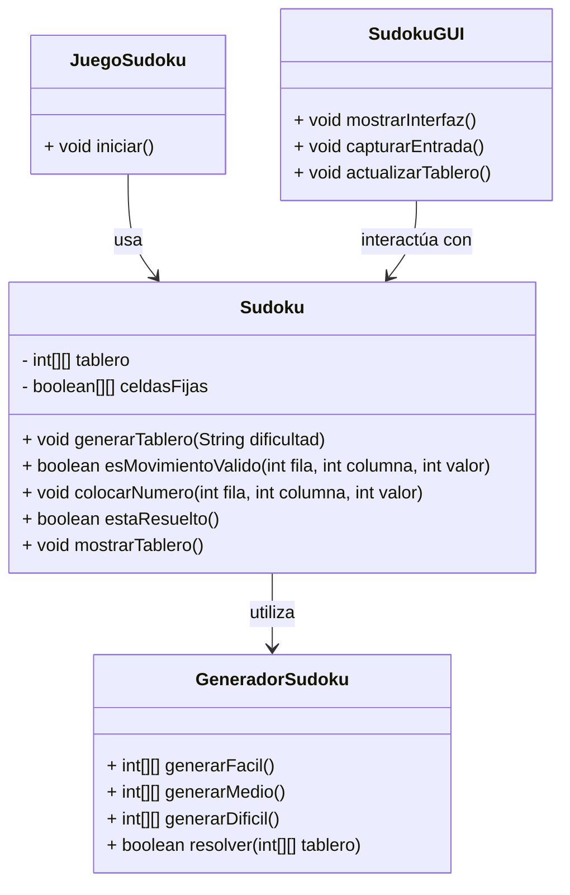
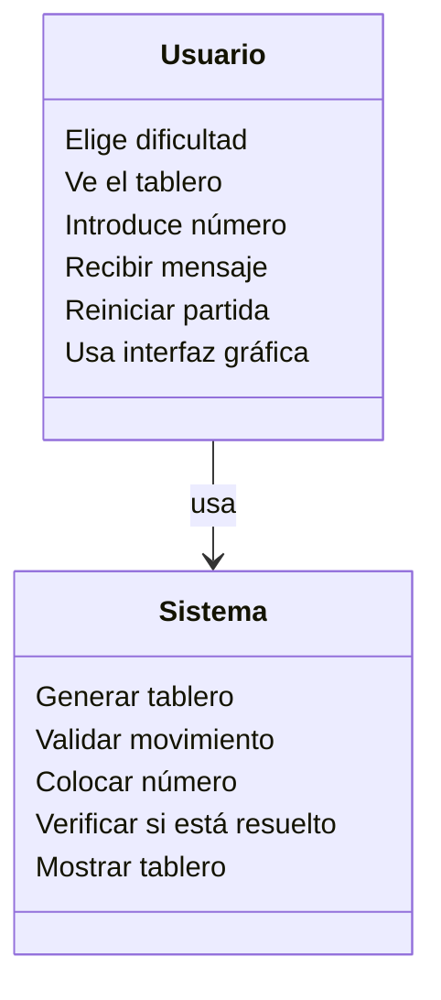

## 1. Documento de análisis de requerimientos

### Descripcion general
Desarrollar una aplicación de escritorio en Java que permita a los usuarios jugar al juego de Sudoku, incluyendo generación automática de tableros, validación de jugadas en tiempo real, y verificación de la solución.

### Requisitos funcionales
- RF1: El sistema debe generar tableros de Sudoku con tres niveles de dificultad: fácil, medio y difícil.
- RF2: El usuario debe poder introducir valores en el tablero manualmente.
- RF3: El sistema debe validar si un movimiento es válido según las reglas del Sudoku.
- RF4: El sistema debe verificar si el tablero está completamente y correctamente resuelto.
- RF5: El sistema debe mostrar el tablero actualizado en consola o GUI.
- RF6: La interfaz gráfica debe permitir interacción intuitiva y sin ambigüedad.

### Requisitos no funcionales
- RNF1: La aplicación debe desarrollarse utilizando Java (POO, estructuras de datos, Swing/JavaFX).
- RNF2: El código debe estar bien documentado y estructurado.
- RNF3: Se debe manejar errores mediante excepciones específicas.
- RNF4: Debe garantizarse la trazabilidad entre requisitos, código y pruebas.
- RNF5: Las pruebas deben implementarse con JUnit.

## Casos de Uso

| ID    | Nombre             | Actor(es) | Precondición                  | Flujo Principal             || Postcondición                   |
| ----- | ------------------ | --------- | ----------------------------- | --------------------------------------------------------- | ----------------------------------- | ------------------------------- |
| CU-01 | Generar Sudoku     | Usuario   | Inicio de juego               | 1. Usuario selecciona nivel 2. Sistema genera tablero  |  | Tablero Sudoku generado         |
| CU-02 | Introducir número  | Usuario   | Tablero generado              | 1. Usuario introduce número en celda 2. Sistema valida |  | Número insertado o rechazo      |
| CU-03 | Validar movimiento | Sistema   | Número introducido            | Sistema comprueba reglas Sudoku                        |  | Movimiento aceptado o rechazado |
| CU-04 | Mostrar error      | Sistema   | Movimiento inválido detectado | El sistema muestra mensaje de error                       |                                  | Usuario informado del error     |

### Objetivos
- Proveer un juego funcional y estable de Sudoku
- Garantizar respuesta rápida en la UI  
- Documentar el código y sus funcionalidades       
---

## 2. Diagramas UML
### Diagrama de Clases
Incluye las siguientes clases principales:

- `Sudoku`: Contiene la lógica del tablero y validaciones.
- `GeneradorSudoku`: Genera tableros válidos.
- `JuegoSudoku`: Controla el flujo del juego.
- `SudokuGUI`: Implementa la interfaz gráfica.

### Diagrama de Casos de Uso

## 3. Matriz de Trazabilidad
| Requisito | Clase/Método                     | Prueba JUnit                           |
|-----------|----------------------------------|----------------------------------------|
| RF1       | `GeneradorSudoku.generarTablero()` | `GeneradorSudokuTest.testGenerarTableroFacil()`      |
| RF2       | `Sudoku.colocarNumero()`         | `SudokuTest.testColocarNumero()`       |
| RF3       | `Sudoku.esMovimientoValido()`    | `SudokuTest.testMovimientoInvalido()`  |
| RF4       | `Sudoku.estaResuelto()`          | `SudokuTest.testEstaResuelto()`        |
| RF5       | `SudokuGUI`                      | `SudokuGUITest.testCreacionGUI()`         |
| RNF5      | Todas las clases                 | Múltiples pruebas con JUnit            |
---
## 4. Código Fuente
El proyecto incluye las siguientes clases, todas documentadas y comentadas en el código:

- `Sudoku.java`
- `GeneradorSudoku.java`
- `JuegoSudoku.java`
- `SudokuGUI.java`

---

## 5. Pruebas Unitarias con JUnit

### Resultados
Los resultados de las pruebas se adjuntan con capturas:

