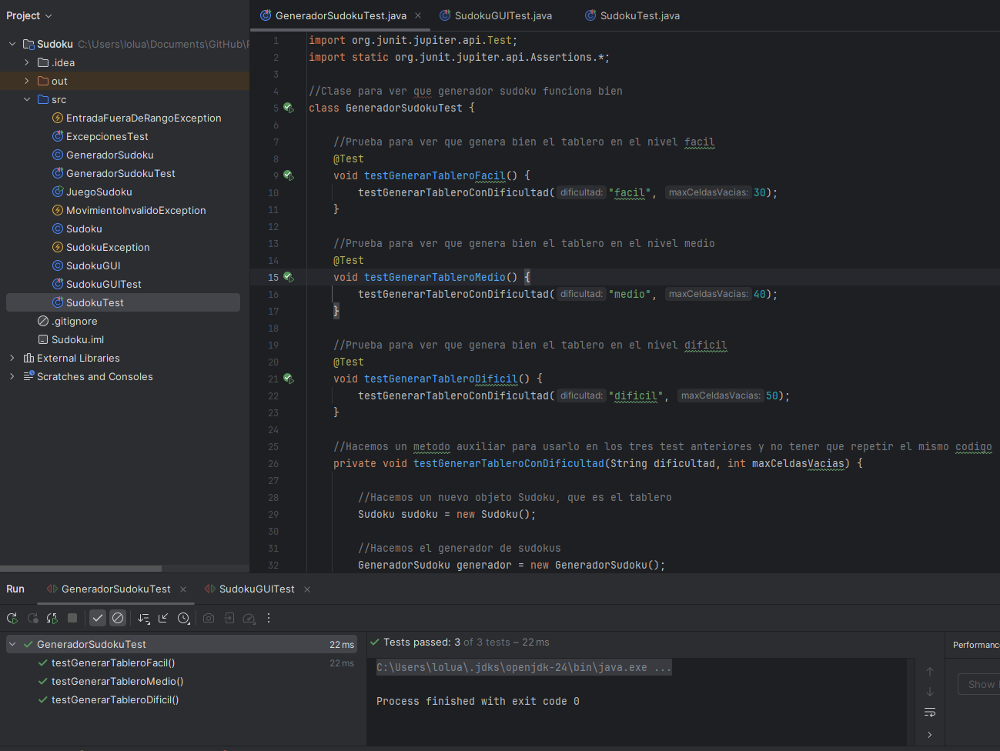
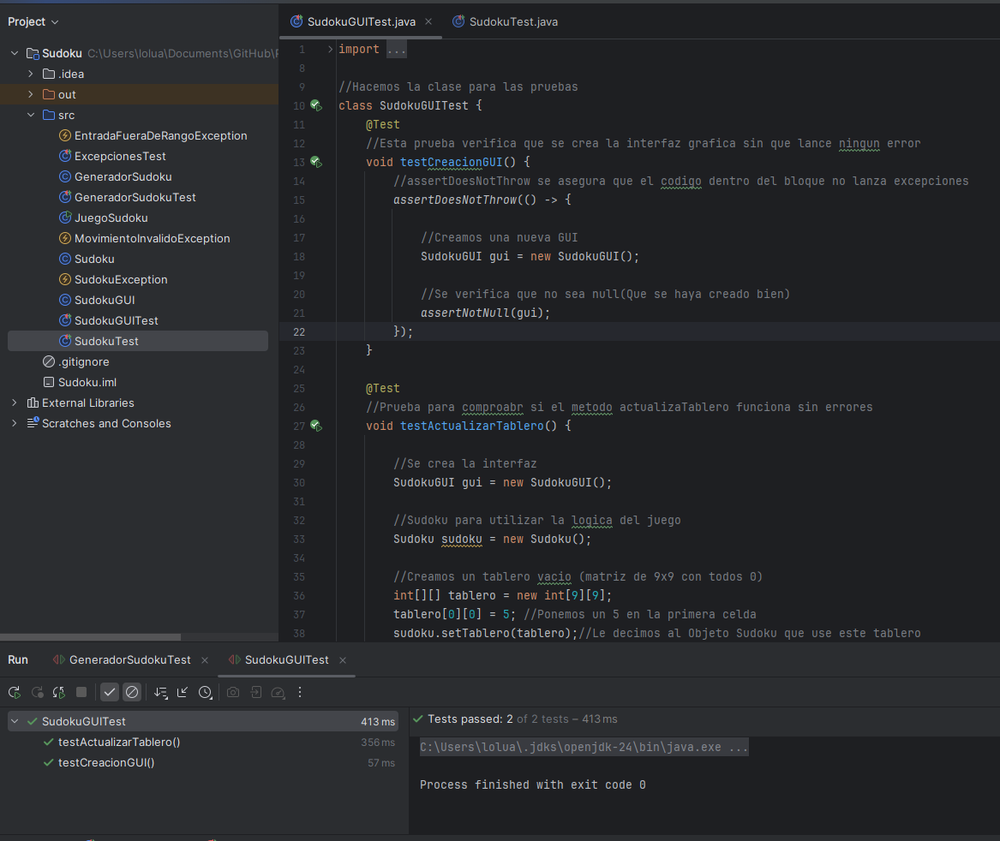

## 1. Documento de análisis de requerimientos

### Descripcion general
Desarrollar una aplicación de escritorio en Java que permita a los usuarios jugar al juego de Sudoku, incluyendo generación automática de tableros, validación de jugadas en tiempo real, y verificación de la solución.

### Requisitos funcionales
- RF1: El sistema debe generar tableros de Sudoku con tres niveles de dificultad: fácil, medio y difícil.
- RF2: El usuario debe poder introducir valores en el tablero manualmente.
- RF3: El sistema debe validar si un movimiento es válido según las reglas del Sudoku.
- RF4: El sistema debe verificar si el tablero está completamente y correctamente resuelto.
- RF5: El sistema debe mostrar el tablero actualizado en consola o GUI.
- RF6: La interfaz gráfica debe permitir interacción intuitiva y sin ambigüedad.

### Requisitos no funcionales
- RNF1: La aplicación debe desarrollarse utilizando Java (POO, estructuras de datos, Swing/JavaFX).
- RNF2: El código debe estar bien documentado y estructurado.
- RNF3: Se debe manejar errores mediante excepciones específicas.
- RNF4: Debe garantizarse la trazabilidad entre requisitos, código y pruebas.
- RNF5: Las pruebas deben implementarse con JUnit.

## Casos de Uso

| ID    | Nombre             | Actor(es) | Precondición                  | Flujo Principal                                           | Flujos Alternativos                 | Postcondición                   |
| ----- | ------------------ | --------- | ----------------------------- | --------------------------------------------------------- | ----------------------------------- | ------------------------------- |
| CU-01 | Generar Sudoku     | Usuario   | Inicio de juego               | 1. Usuario selecciona nivel 2. Sistema genera tablero  | 2a. Error generación → mensaje      | Tablero Sudoku generado         |
| CU-02 | Introducir número  | Usuario   | Tablero generado              | 1. Usuario introduce número en celda 2. Sistema valida | 2a. Número inválido → error         | Número insertado o rechazo      |
| CU-03 | Validar movimiento | Sistema   | Número introducido            | 1. Sistema comprueba reglas Sudoku                        | 1a. Movimiento inválido → excepción | Movimiento aceptado o rechazado |
| CU-04 | Mostrar error      | Sistema   | Movimiento inválido detectado | 1. Sistema muestra mensaje de error                       | -                                   | Usuario informado del error     |

### Objetivos
- Proveer un juego funcional y estable de Sudoku
- Garantizar respuesta rápida en la UI  
- Documentar el código y sus funcionalidades       
---

## 2. Diagramas UML
### Diagrama de Clases
Incluye las siguientes clases principales:

- `Sudoku`: Contiene la lógica del tablero y validaciones.
- `GeneradorSudoku`: Genera tableros válidos.
- `JuegoSudoku`: Controla el flujo del juego.
- `SudokuGUI`: Implementa la interfaz gráfica.
- `EntradaFueraDeRangoException`: Lanza la excepcion.
- `MovimientoInvalidoException`: Lanza la excepcion.
- `SudokuException`: Clase base para las excepciones.

### Diagrama de Casos de Uso

## Diagrama de Actividad

## 3. Matriz de Trazabilidad
| Req. ID | Objetivo(s) | Caso de Uso / Diseño     | Caso de Prueba               |
| ------- | ----------- | ------------------------ | ---------------------------- |
| RF-01   | OBJ-01      | CU-01 Generar Sudoku     |  Generación tablero     |
| RF-02   | OBJ-01      | CU-02 Introducir número  | Inserción número       |
| RF-03   | OBJ-01      | CU-03 Validar movimiento | Validación movimientos |
| RF-04   | OBJ-01      | CU-04 Mostrar error      | Mensajes de error      |
---
## 4. Código Fuente
El proyecto incluye las siguientes clases principales, todas documentadas y comentadas en el código:

- `Sudoku.java`
- `GeneradorSudoku.java`
- `JuegoSudoku.java`
- `SudokuGUI.java`
- `SudokuException.java`
- `EntradaFueraDeRangoException.java`
- `MovimientoInvalidoException.java`
- `ExcepcionesTest.java`
- `GeneradorSudokuTest.java`
- `SudokuGUITest.java`
- `SudokuTest.java`

---

## 5. Excepciones 

El proyecto implementa excepciones específicas para manejar errores particulares:

- SudokuException.java: Clase base para las excepciones personalizadas en el proyecto.

- MovimientoInvalidoException.java: Excepción lanzada cuando un movimiento viola las reglas del Sudoku.

- EntradaFueraDeRangoException.java: Excepción para entradas fuera de los límites válidos del tablero.

## 6. Pruebas Unitarias con JUnit

### Resultados
Los resultados de las pruebas se adjuntan con capturas:

